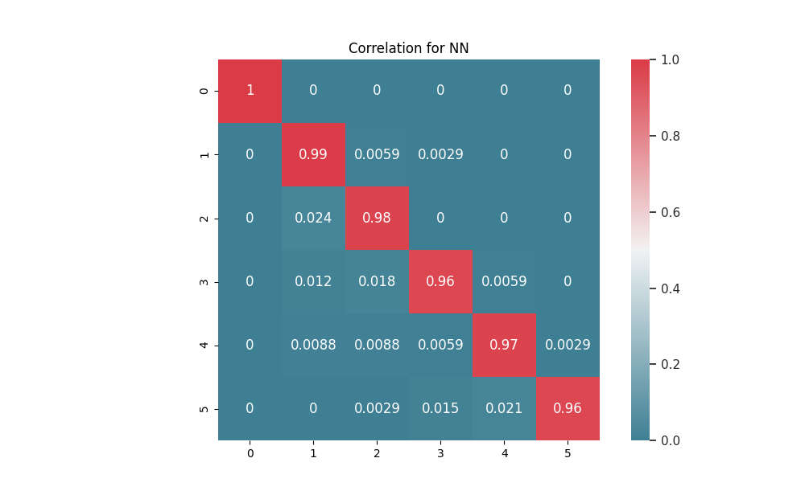

# FINNger

FINNger is a CNN intended to detect how many raised fingers you have through your webcam (or any image capturing device, actually). The final intention from this work is to create a mobile app where children can learn some basic arithmetics. This is mostly the code for the model generation, with a small proof-of-concept to check that it would really work.

More information about the work per se and the model can be found on the paper: _link unavailable at the moment_

## Installing

We need `Python3` to run this code. To install our library dependencies you can run `pip3 install -r requirements.txt`.

## Dataset

By default, we already have one of the used datasets available on this repository. You can run, from the root the command `./extract_dataset.sh` and the custom dataset will be available on `model/<dataset_name>`.

To download [koriakinp/fingers](https://www.kaggle.com/koryakinp/fingers) repository, refer to Kaggle website to understand how you can download the dataset.

## Model

A trained model is not available in the repository. However, on the releases tab we made the final model and optimizer state available for demonstration purposes.

## Results

As stated above, the full results can be found on the paper. However, here we have a small demonstration of the high accuracy of the trained model on the validation images. On this image, the row is the expected value, and the columns is the FINNger model output value.

## Authors

- [Rafael Baldasso Audibert](https://www.rafaaudibert.dev) 
- Vinicius Maschio
